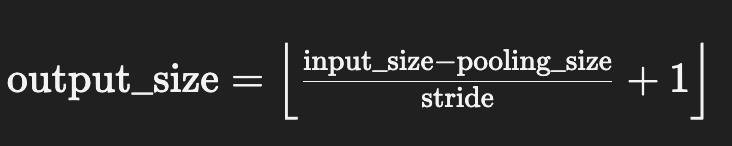
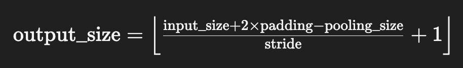

# BatmanInfer

### 项目目标

* 设备: Mobile GPU、CPU

### 1.1 一期目标 

* 实现LSTM模型编译 (2024-10-31截止)
* 实现GPT-2模型编译
* 实现Int8量化

> **技术难点**
>
> KVCaches增加
>
> `ONNX`模型转译`Operator`
>
> `OpenCL`和`GPU` 中的算子加速

**已知问题**

1. 编译`onnx`到系统需要先进行```protoc -I=. --cpp_out=. onnx.proto```
2. 关注`CMakeLists`几个库的设置

### 1.2 OpenMP的`API`接口

#### `#pragma omp parallel for`

> 循环的每次迭代可以由一个独立的线程执行

`#pragma omp critical`

> 临界区是指一段必须由一个线程独占执行的代码，以防止数据竞争

`pragma omp simd`

> 用于将 SIMD（单指令多数据）向量化应用于后续的循环

### 1.3 Android编译指令

```shell
cmake -DCMAKE_TOOLCHAIN_FILE=$ANDROID_NDK_HOME/build/cmake/android.toolchain.cmake \
      -DANDROID_ABI=arm64-v8a \
      -DANDROID_NATIVE_API_LEVEL=27 \
      -DANDROID=ON \
      -DOpenCV_DIR=../opencv_android_sdk/sdk/native/jni/abi-arm64-v8a \
      ..
```


### 1.4 算子模块

#### 1. `Conv`算子 - 非padding



> 1. **input_size**：
>    - 输入特征图的尺寸（可以是高度或宽度）。
> 2. **pooling_size**：
>    - 池化窗口的尺寸（可以是高度或宽度）。池化窗口是在输入特征图上滑动的一个小区域，用于计算最大值或平均值。
> 3. **stride**：
>    - 步长，指池化窗口在输入特征图上滑动时每次移动的距离。步长越大，输出特征图的尺寸越小，因为窗口覆盖的区域会更少。
> 4. **floor**：
>    - 表示向下取整操作。由于池化窗口可能无法整齐地覆盖输入特征图的所有位置，向下取整确保输出尺寸为整数。

#### 2. `Conv`算子 - 带padding



> 1. **input_size**：
>    - 输入特征图的尺寸（可以是高度或宽度）。
> 2. **padding**：
>    - 填充的大小，指在输入特征图的边缘添加的像素数。填充通常用于防止池化窗口在边缘处无法完全覆盖输入特征图。
> 3. **pooling_size**：
>    - 池化窗口的尺寸（可以是高度或宽度）。池化窗口在输入特征图上滑动，用于计算最大值或平均值。
> 4. **stride**：
>    - 步长，指池化窗口在输入特征图上滑动时每次移动的距离。步长越大，输出特征图的尺寸越小。
> 5. **floor**：
>    - 表示向下取整操作。因为池化窗口可能无法整齐地覆盖输入特征图的所有位置，向下取整确保输出尺寸为整数。

### 3. 代码形象解析

```c++
/**
         * 卷积计算转为: 矩阵计算 (现有较为成熟的矩阵)
         * 将一个nxn的矩阵转为 1 x (nxn)的行向量
         * @param input: 输入特征图像
         * @param kernel_w: 卷积核宽度
         * @param kernel_h: 卷积核高度
         * @param input_w: 输入特征的宽度
         * @param input_h: 输入特征的高度
         * @param input_c_group: 每个group处理的通道数量
         * @param group: 当前Im2Col的组数(Group)
         * @param row_len: 卷积核展开后的列数
         * @param col_len: 卷积计算的次数
         * @return
         */ 
arma::fmat ConvolutionLayer::Im2Col(BatmanInfer::sftensor input,
                                        uint32_t kernel_w,
                                        uint32_t kernel_h,
                                        uint32_t input_w,
                                        uint32_t input_h,
                                        uint32_t input_c_group,
                                        uint32_t group,
                                        uint32_t row_len,
                                        uint32_t col_len)
```

**输入特征**

> - **输入特征图尺寸**：$5 \times 5$
> - **卷积核尺寸**：$ 3 \times 3 $
> - **步长**：1
> - **填充**：1
> - **输入通道数**：4（每组）
> - **分组数**：2

```C++
arma::fmat input_matrix(input_c_group * row_len, col_len)
```

> * `input_c_group`:  每个组的输入通道数，这个例子是4
> * `row_len`:  对于$3 \times 3$ 的`卷积核`. `row_len`通常为$ 3 \times 3 = 9$
> * `col_len`:  展开矩阵的列数。这个值取决于`滑动窗口`在输入特征图上移动的次数，$7 \times 7$ 输入和$ 3 \times 3$ 的卷积核, 步长为1, 可以移动$ 5 \times 5 = 25$
>
> **具体操作:**
>
> * `input_matrix`: 一个大小为$(4 \times 9) \times 25 = 36 \times 25$的矩阵
>   * **列数**: $4 \times 9 = 36$, 因为每个通道展开为9行，每组有4个通道
>   * **行数**: 25  (`因为arma的特点`)

```C++
const uint32_t input_padded_h = input_h + 2 * padding_h_;
const uint32_t input_padded_w = input_w + 2 * padding_w_;
```

> * **`input_padded_h` 和 `input_padded_w`**：计算填充后的输入特征图尺寸。对于 $ 5 \times 5$的输入，加上 1 的填充，变为 $ 7 \times 7$

```c++
for (uint32_t ic = 0; ic < input_c_group; ++ic) 
  float* input_channel_ptr = input->matrix_raw_ptr(ic + group * input_c_group);
```

> * `ic`: 遍历当前组内的每个通道
> * `input_channel_ptr`: 指向当前通道的数据起始位置

```c++
uint32_t current_col = 0;
uint32_t channel_row = ic * row_len;
```

> * `current_col`: 当前列索引，用于在展开矩阵中定位
> * `channel_row`: 计算当前通道在展开矩阵中的起始行位置

```c++
for (uint32_t w = 0; w < input_padded_w - kernel_w + 1; w += stride_w_) {
    for (uint32_t r = 0; r < input_padded_h - kernel_h + 1; r += stride_h_) {
        float* input_matrix_ptr = input_matrix.colptr(current_col) + channel_row;
        current_col += 1;
    }
}
```

> - **外层循环**：遍历输入图像的宽度方向。
> - **内层循环**：遍历输入图像的高度方向。
> - **`input_matrix_ptr`**：指向 `input_matrix` 中当前列位置的指针，用于存放从 `input_channel_ptr` 复制过来的数据。
> - **`current_col`**：每次迭代递增，表示移动到下一个列位置。

#### 2. GlobalAveragePool (全局平均池化)

> **作用**:  对输入张量的每个通道的所有元素的平均值来减少"数据的维度"
>
> **数学解释**:
>
> 假设我们有一个**输入张量** $X$ 的形状为 $[N,C,H,W]$，其中：
>
> - $N$ 是批次大小（batch size）。
> - $C$ 是通道数（channels）。
> - $H$ 是高度（height）。
> - $W$ 是宽度（width）。
>
> 输出张量$Y$ 的形状$[N, C, 1, 1]$
>
> **数学公式**:
>
> $ Y_{n, c, 0, 0} = \frac{1}{H \times W} \sum_{h=0}^{H-1} \sum_{w=0}^{W-1} X_{n, c, h, w} $
>
> **数学例子**:
>
> 假设我们有一个简单的输入张量 $ X $ ，其形状为 $[1, 1, 2, 2]$，即一个批次、一个通道、高度为2、宽度为2。具体的张量值为：
>
> $  X = \begin{bmatrix}  \begin{bmatrix} 1 & 2 \\ 3 & 4 \end{bmatrix} \end{bmatrix}   $
>
> 对于这个输入张量，GlobalAveragePool的计算过程如下：
>
> 1. 计算通道内所有元素的和：
>
>    $ \text{Sum} = 1 + 2 + 3 + 4 = 10 $
>
> 2. 计算平均值：
>
>    $$ \text{Average} = \frac{\text{Sum}}{H \times W} = \frac{10}{2 \times 2} = \frac{10}{4} = 2.5 $$
>
> 因此，输出张量 $ Y $ 为：
>
> $ Y = \begin{bmatrix} \begin{bmatrix} 2.5 \end{bmatrix} \end{bmatrix} $
>
> **应用场景**
>
> \- **降维**：GlobalAveragePool通过减少空间维度从 $[H, W]$ 到 $[1, 1]$）来降低模型的参数量和计算复杂度。
>
> \- **特征提取**：保留整个特征图的全局信息，有助于在分类任务中利用全局特征。
>
> \- **替代全连接层**：在某些网络架构中，全局平均池化可以替代全连接层，减少参数数量并防止过拟合。
>
> 这种算子在卷积神经网络（CNN）中非常常见，尤其是在现代深度学习模型的最后几层中，用于生成固定大小的特征向量

#### 3. Flatten 算子

> **作用**:
>
> * **输入**: 一个具有任意维度的张量
> * **输出**: 一个二维张量 [`batch_size`, `seq_length`]
>
> **参数**:
>
> * `axis`: 这是一个整数参数, 指定从哪个轴开始展平。默认情况下, `axis = 1`, 这意味着输入张量的第一个维度（通常是批量大小）保持不变，其余的维度被展平成一个维度。
>
> **实例**
>
> 假设有一个输入张量 `X`，其形状为 $[N, C, H, W]$，其中 $N$ 是批量大小，$C$ 是通道数，$H$ 和 $W$ 是高度和宽度。
>
> - 如果 `axis=1`，Flatten 操作将把输入张量展平成形状为 $[N, C \times H \times W]$ 的二维张量。
> - 如果 `axis=2`，Flatten 操作将把输入张量展平成形状为 $[N \times C, H \times W]$的二维张量。
>
> **应用场景**
>
> Flatten 算子通常用于卷积神经网络（CNN）中，在卷积和池化层之后，将特征图展平，以便连接到全连接层。这是因为全连接层通常需要一维输入

#### 4. Gemm算子 - 通用矩阵乘法

> 公式:
>
> $Y = \alpha \times (A \times B) + \beta \times C$
>
> **1. Attributes(属性)**
>
> * **alpha**: (缩放因子), 默认为1, 用于缩放矩阵乘积 $ A \times B $
> * **beta**: (缩放因子), 默认为1。 用于缩放矩阵$C$
> * **transB**: 如果为1，表示矩阵$B$需要转置
>
> **2. Inputs(输入)**
>
> * **A**: 输入矩阵
> * **B**: 权重矩阵
> * **C**: 偏置矩阵
>
> **3.例子**
>
> - $ A $ 是一个 2x3 的矩阵：
>   $A = \begin{bmatrix}1 & 2 & 3 \\ 4 & 5 & 6\end{bmatrix}$
>   
> - $ B $ 是一个 3x2 的矩阵：
>   $B = \begin{bmatrix}7 & 8 \\9 & 10 \\11 & 12\end{bmatrix}$
>   
> - $ C $ 是一个 2x2 的矩阵：
>  $ C = \begin{bmatrix} 1 & 1 \\1 & 1\end{bmatrix}$
> 
> 根据Gemm的计算公式：
> 
> 1. 计算 $ A \times B $：
>    $A \times B = \begin{bmatrix}1 \times 7 + 2 \times 9 + 3 \times 11 & 1\times 8 + 2 \times 10 + 3 \times 12 \\4 \times 7 + 5 \times 9 + 6 \times 11 &4\times 8 + 5 \times 10 + 6 \times 12\end{bmatrix} = \begin{bmatrix}58 & 64 \\139 & 154\end{bmatrix}$
>    
> 2. 计算最终输出 $ Y = \alpha \times (A \times B) + \beta \times C $：
>    $Y = 1 \times \begin{bmatrix}58 & 64 \\139 & 154\end{bmatrix} + 1 \times \begin{bmatrix}1 & 1 \\1 & 1\end{bmatrix} = \begin{bmatrix}59 & 65 \\140 & 155\end{bmatrix}$

#### 5. Concat (Concatenate) 算子 - 合并张量

> **作用**:
>
> 在 ONNX 中，`Concat`（Concatenate）算子用于将多个张量沿指定的轴拼接（连接）起来。它的主要作用是将输入的张量合并为一个更大的张量。
>
> 1. **输入**：
>    - `Concat` 接收多个张量作为输入。这些张量必须在非拼接轴上的形状相同。
>    - `inputs` 包含两个输入张量 `/attention/Slice_1_output_0` 和 `/attention/Slice_2_output_0`。
>
> 2. **属性**：
>    - **`axis`**：指定沿哪个轴进行拼接。  
>      在你的截图中，`axis=0`，表示沿第 0 维（通常是 batch 维度）拼接。
>
> 3. **输出**：
>    - 输出是一个新的张量，其形状在拼接轴上是输入张量的形状之和，而其他轴的形状保持不变。
>    - 在你的截图中，输出张量是 `/attention/Concat_output_0`。
>
> **示例**
>
> 假设有两个输入张量：
>
> - $ \text{Tensor A} $ 形状为 $[2, 3]$:
>  $
>   \mathbf{A} = \begin{bmatrix}
>   1 & 2 & 3 \\
>   4 & 5 & 6
>   \end{bmatrix}
>   $
> 
> - $ \text{Tensor B} $ 形状为 $[3, 3]$:
>   $
>   \mathbf{B} = \begin{bmatrix}
>    7 & 8 & 9 \\
>   10 & 11 & 12 \\
>   13 & 14 & 15
>   \end{bmatrix}
>   $
> 
> 如果沿着 $ \text{axis} = 0 $ 进行拼接，结果为：
> 
> $
>\text{Concat}(\mathbf{A}, \mathbf{B}) = \begin{bmatrix}
> 1 & 2 & 3 \\
>4 & 5 & 6 \\
> 7 & 8 & 9 \\
> 10 & 11 & 12 \\
> 13 & 14 & 15
> \end{bmatrix}
> $
> 
> 输出的形状为 $[5, 3]$。
